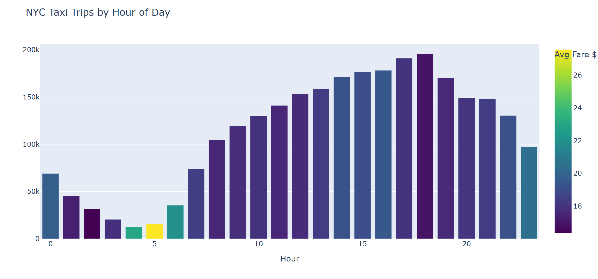
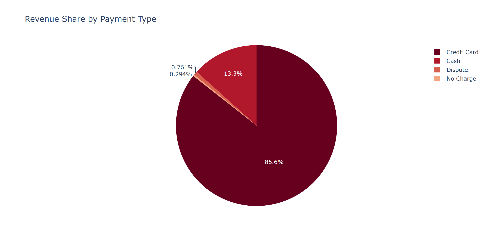
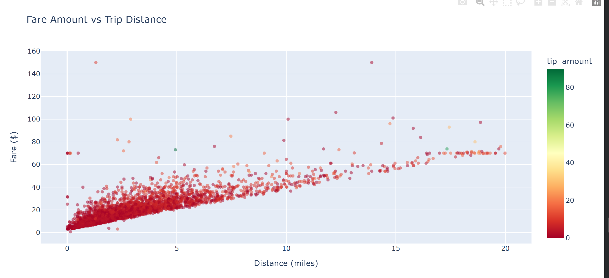

# nyc-taxi-pipeline

End-to-end data engineering pipeline processing 3M+ real NYC yellow taxi trips (Jan 2024)
into a star schema warehouse. Demonstrates production ETL patterns: dimensional modeling,
PySpark analysis, Airflow orchestration, and automated data quality checks.

---

## pipeline architecture

```
extract (NYC TLC parquet — 2,964,624 raw trips)
        ↓
transform (filter + enrich — 2,721,084 clean trips, 8.2% removed)
        ↓
star schema → DuckDB (nyc_taxi_warehouse.db)
  fact_trips    (2,721,084 rows)  trip metrics + MD5 hash surrogate key
  dim_time         (749 rows)     pickup slot, is_weekend, time_of_day
  dim_location     (265 rows)     real TLC zone lookup (borough + zone)
  dim_payment        (4 rows)     payment type mapping
        ↓
PySpark analysis (busiest hours, revenue by payment type)
        ↓
DuckDB SQL (star schema joins — weekend vs weekday, top zones)
        ↓
Plotly charts (3 saved to images/)
        ↓
data quality checks (8 assertions, all pass)
        ↓
Airflow DAG (daily, catchup=False, retries=2)
```

---

## stack

| Layer | Tool |
|---|---|
| Extract | Python, Pandas |
| Transform | Pandas |
| Warehouse | DuckDB |
| Modeling | Star schema (fact + 4 dims) |
| Surrogate keys | MD5 hash (not range-based) |
| Analysis | PySpark, DuckDB SQL |
| Orchestration | Apache Airflow |
| Visualization | Plotly |

---

## star schema

```
        dim_time (749 rows)
             |
dim_location--fact_trips (2,721,084)--dim_payment
  (265 rows)                            (4 rows)
```

**fact_trips** — trip metrics + MD5 hash surrogate key (`trip_id`)
- pickup_date, pickup_hour, PULocationID, DOLocationID
- passenger_count, trip_distance, fare_amount, tip_amount, total_amount
- trip_duration_mins, payment_type

**dim_time** — time context per pickup slot
- pickup_date, pickup_hour, pickup_day, is_weekend
- time_of_day: Morning / Afternoon / Evening / Night

**dim_payment** — payment lookup (4 types)
- payment_type, payment_type_name, payment_id

**dim_location** — real TLC zone lookup (265 NYC zones, not hardcoded)
- location_id, borough, zone, service_zone

---

## folder layout

```
nyc-taxi-pipeline/
├── nyc_taxi_pipeline.ipynb    # full pipeline: extract → load → analysis
├── dags/
│   └── nyc_taxi_dag.py        # Airflow DAG, daily schedule
├── images/
│   ├── chart_trips_by_hour.png
│   ├── chart_payment_revenue.png
│   └── chart_fare_vs_distance.png
├── requirements.txt
└── README.md
```

---

## key findings

### busiest hours
| Hour | Trips | Avg Fare | Total Revenue |
|---|---|---|---|
| 18:00 (Evening) | 195,782 | $16.94 | $5,273,198 |
| 17:00 (Evening) | 191,089 | $18.05 | $5,391,201 |
| 16:00 (Afternoon) | 178,199 | $19.40 | $5,305,335 |


### payment type revenue
| Payment | Trips | Revenue | Avg Tip |
|---|---|---|---|
| Credit Card | 2,271,549 | $63,797,700 | $4.16 |
| Cash | 417,148 | $9,941,876 | $0.00 |
| Dispute | 22,597 | $567,168 | $0.00 |
| No Charge | 9,790 | $219,418 | $0.01 |

Credit card accounts for ~85% of all revenue.

### weekend vs weekday
| Day Type | Trips | Avg Fare | Avg Tip |
|---|---|---|---|
| Weekday | 2,031,064 | $18.62 | $3.52 |
| Weekend | 690,020 | $17.84 | $3.34 |

---

## charts

**trips by hour of day**


**revenue by payment type**


**fare amount vs trip distance**


---

## airflow dag

**DAG ID:** `nyc_taxi_pipeline` | **Schedule:** Daily | **Catchup:** False | **Retries:** 2

```
extract_taxi_data >> transform_clean >> build_star_schema
    >> spark_analysis >> data_quality_checks
```


## data quality checks

| Check | Result |
|---|---|
| Negative fares | 0 ✓ |
| Zero distances | 0 ✓ |
| Null trip_id | 0 ✓ |
| Hollow dim_location (hardcoded zones) | 0 ✓ |
| dim_time rows | 749 ✓ |
| dim_payment rows | 4 ✓ |
| dim_location rows | 265 ✓ |
| fact_trips rows | 2,721,084 ✓ |

---

## data source

NYC TLC open data (publicly available):
- Trips: `https://d37ci6vzurychx.cloudfront.net/trip-data/yellow_tripdata_2024-01.parquet`
- Zone lookup: `https://d37ci6vzurychx.cloudfront.net/misc/taxi_zone_lookup.csv`

---

## how to run

```bash
git clone https://github.com/Shibin2000/nyc-taxi-pipeline
cd nyc-taxi-pipeline
pip install -r requirements.txt

# open in Google Colab or Jupyter and run all cells
# nyc_taxi_pipeline.ipynb

# for Airflow
cp dags/nyc_taxi_dag.py $AIRFLOW_HOME/dags/
airflow dags trigger nyc_taxi_pipeline
```
